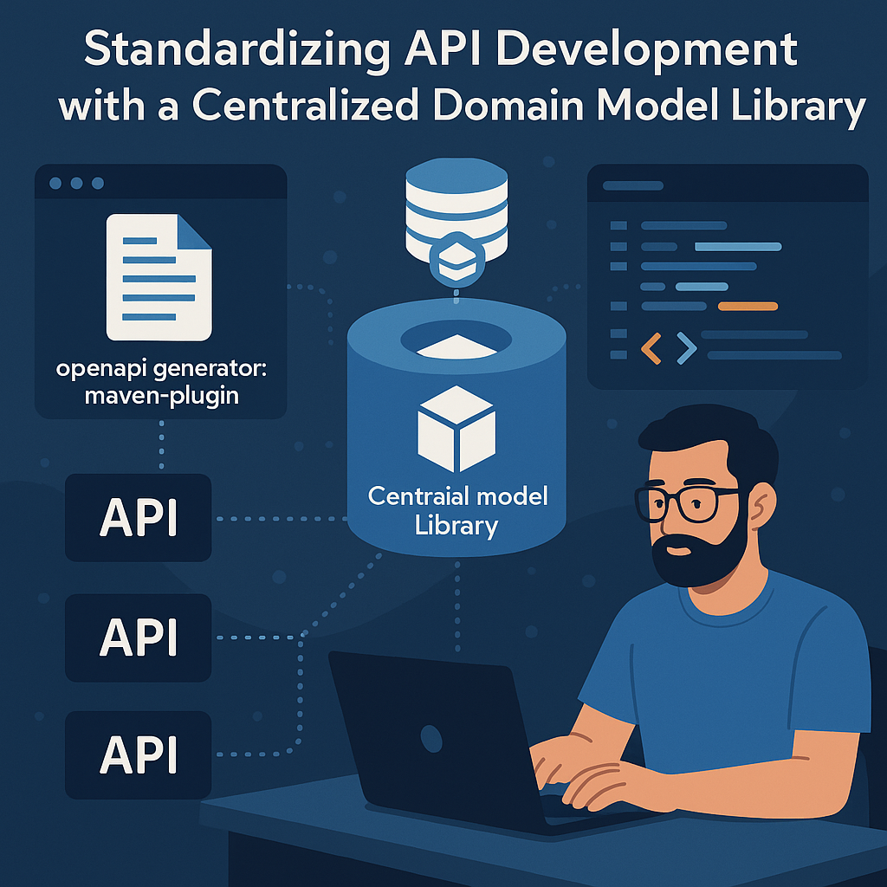
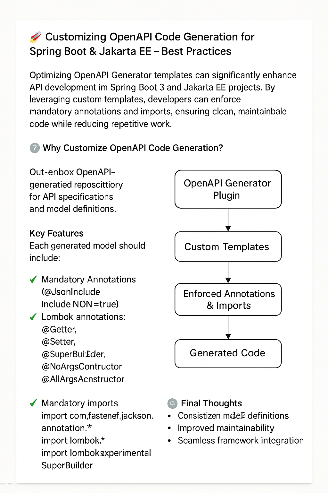

# **Custom OpenAPI Code Generation for Spring Boot & Jakarta EE**


This project provides a streamlined approach to customizing **OpenAPI Generator** templates, allowing developers to optimize generated models with **mandatory annotations and imports**. Ideal for **Spring Boot 3, Jakarta EE**, and frameworks requiring **JSON serialization** and **Lombok automation**.

# Domain Specification Library (`domain-specification-lib`)

## Overview
The **Domain Specification Library** (`domain-specification-lib`) serves as a centralized repository for **interchange model definitions** and **API specifications**. It integrates **automatic Java POJO generation**, ensuring seamless API development while maintaining structured interfaces.

This library leverages **OpenAPI Code Generator** to automate Java model and API stub creation, optimizing development workflows and enhancing consistency.

---

## Features
- 📌 **Centralized Model Management**
    - Stores API specifications and data models in a structured format.
- 🚀 **Automatic Code Generation**
    - Generates Java POJOs and API interfaces from OpenAPI definitions.
- ⚙️ **Spring Boot & Jakarta EE Compatibility**
    - Supports modern frameworks with Jakarta EE and Spring Boot 3.
- 🔗 **Custom OpenAPI Generator Templates**
    - Provides fine-tuned customization for API and model generation.
- 📈 **Optimized API Development Workflow**
    - Reduces manual coding efforts with automated model creation.
- 🔍 **Validation & Documentation**
    - Supports Swagger-based validation with auto-generated documentation.
- ♻️ **Modular Architecture**
    - Includes multi-module support for scalable development.

---

## Project Structure

```xml
  <groupId>com.technext.spec</groupId>
  <artifactId>domain-specification-lib</artifactId>
  <version>1.0-SNAPSHOT</version>
  <packaging>pom</packaging>
```
This repository follows a modular structure:
```xml
<modules>
    <module>employee-info</module>
</modules>
```
## Dependencies
The library incorporates several essential dependencies for robust API modeling and implementation:
```xml
<dependencies>
    <!-- Jakarta EE & Servlet APIs -->
    <dependency>
        <groupId>jakarta.servlet</groupId>
        <artifactId>jakarta.servlet-api</artifactId>
        <version>6.1.0</version>
        <scope>provided</scope>
    </dependency>

    <!-- Swagger & OpenAPI -->
    <dependency>
        <groupId>io.swagger.core.v3</groupId>
        <artifactId>swagger-models</artifactId>
        <version>2.2.30</version>
    </dependency>
    <dependency>
        <groupId>io.swagger.core.v3</groupId>
        <artifactId>swagger-annotations</artifactId>
        <version>2.2.19</version>
    </dependency>

    <!-- Spring Boot & Feign Client -->
    <dependency>
        <groupId>org.springframework.cloud</groupId>
        <artifactId>spring-cloud-starter-openfeign</artifactId>
        <version>4.2.1</version>
    </dependency>
</dependencies>
```

## OpenAPI Code Generation
This project utilizes the OpenAPI Generator Maven Plugin to automate API stub generation and model creation.

### Configuration:
```xml
<plugin>
    <groupId>org.openapitools</groupId>
    <artifactId>openapi-generator-maven-plugin</artifactId>
    <version>${openapi-generator.version}</version>
    <executions>
        <execution>
            <id>api-code-generator</id>
            <goals>
                <goal>generate</goal>
            </goals>
            <configuration>
                <skip>${api.build.skip}</skip>
                <inputSpec>${project.basedir}/src/main/resources/${model}-api.yml</inputSpec>
                <output>${project.build.directory}/generated-source/openapi</output>
                <generatorName>spring</generatorName>
                <apiPackage>${model.package}.${model}.${model.version}.api</apiPackage>
                <modelPackage>${model.package}.${model}.${model.version}.model</modelPackage>
                <library>spring-cloud</library>
                <generateSupportingFiles>true</generateSupportingFiles>
            </configuration>
        </execution>
    </executions>
</plugin>
```

### Key Customizations:
- Custom template directory for Java Spring generation.
- Supports Spring Boot 3, Jakarta EE, and Delegate Patterns.
- Enables Lombok annotations for generated models:
  ```xml
  <additionalModelTypeAnnotations>
    @lombok.Data
    @lombok.NoArgsConstructor
    @lombok.AllArgsConstructor
    @JsonInclude(JsonInclude.Include.NON_NULL)
    @JsonIgnoreProperties(ignoreUnknown = true)
  </additionalModelTypeAnnotations>
  ``` 

## Build & Deployment Instructions
#### 🛠️ Building the Project:
To build the domain-specification-lib, run the following Maven command:
```bash
mvn clean install
```

#### 📦 Generated Artifacts
After building the project, the generated API models and specifications will be available in:
```bash
target/generated-source/openapi
```

#### 🏗️ Customizing API Generation
Modify the configuration settings in pom.xml to:
- Enable or disable OpenAPI validation checks.
- Define custom API packages for model definitions.
- Adjust generated documentation settings.

---
# **Customizing OpenAPI Code Generation**

### **Enhancing API Code with Custom Templates**

When working with **OpenAPI Generator**, ensuring consistency and maintainability in generated models is key. Here’s how to enforce mandatory annotations and imports efficiently.

---

### **Customization Goals**
Every model must include:
1) **Mandatory Annotations**
   - `@JsonInclude(JsonInclude.Include.NON_NULL)`
   - `@JsonIgnoreProperties(ignoreUnknown = true)`
   - Lombok annotations: `@Getter`, `@Setter`, `@SuperBuilder`, `@NoArgsConstructor`, `@AllArgsConstructor`

2) **Mandatory Imports**
   - `import com.fasterxml.jackson.annotation.*`
   - `import lombok.*`
   - `import lombok.experimental.SuperBuilder`

---

## **Approach: Template-Based Customization**
OpenAPI Generator provides two ways to tailor code generation:

1. **Custom Generator Development** – Ideal for adding support for new frameworks or languages.
2. **Template Replacement** – A lightweight approach that **refines the structure** without modifying the core generator.

Since we only need to tweak specific templates, we’ll focus on **option two**.

---

### **Locating the Right Template**
For [**Spring-based projects**](https://github.com/OpenAPITools/openapi-generator/tree/v7.13.0/modules/openapi-generator/src/main/resources/JavaSpring), the relevant folder is:

```bash
JavaSpring/
```
Within this directory, you’ll find **Mustache templates** defining the model structure.

Key templates to modify:
- **`model.mustache`** – Controls custom imports.
- **`pojo.mustache`** – Defines class annotations.

---

### **Implementing Custom Templates**

---
#### **Step 1: Define Custom Templates**
1) **pojoCustomAnnotations.mustache**
    ```bash
    // Custom JSON Annotation
    @JsonInclude(JsonInclude.Include.NON_NULL)
    @JsonIgnoreProperties(ignoreUnknown = true)
    
    // Lombok Annotations
    @Getter
    @Setter
    @SuperBuilder
    ```

2) **pojoCustomImports.mustache**
    ```bash
    // Custom Imports
    {{#jackson}}
    import com.fasterxml.jackson.annotation.JsonTypeName;
    import com.fasterxml.jackson.annotation.JsonIgnoreProperties;
    import com.fasterxml.jackson.annotation.JsonInclude;
    import com.fasterxml.jackson.annotation.JsonRawValue;
    {{/jackson}}
    
    // Lombok Imports
    import lombok.*;
    import lombok.experimental.SuperBuilder;
    ```
---
#### **Step 2: Update Existing Templates**
1) **Modify model.mustache:**
    ```bash
    package {{package}};
    {{>pojoCustomImports}}
    // Other unchanged properties omitted...
    ```
2) **Modify pojo.mustache:**
    ```bash
    // Other unchanged properties omitted...
    {{{vendorExtensions.x-class-extra-annotation}}}
    {{/vendorExtensions.x-class-extra-annotation}}
    {{>pojoCustomAnnotations}}
    public {{>sealed}} class {{classname}} {{#parent}} extends {{{parent}}} {{/parent}} 
    {{^parent}}{{#hateoas}} extends RepresentationModel<{{classname}}> {{/hateoas}}{{/parent}}
    {{#vendorExtensions.x-implements}}{{#-first}} implements {{{.}}}{{/-first}}
    {{^-first}}, {{{.}}}{{/-first}}{{/vendorExtensions.x-implements}} {{>permits}} {
    {{#serializableModel}}
    // Other unchanged properties omitted...
    ```
---
#### **Step 3: Update Maven Configuration**
Modify pom.xml to reference the custom templates:
```xml
<!-- Points to a custom template directory -->
<templateResourcePath>${project.basedir}/../templates/JavaSpring</templateResourcePath>
```
---
#### **Step 4:Run the Maven build to generate code**
```bash
mvn clean install
```
---
[!NOTE]
Comment out the additionalModelTypeAnnotations tag in pom.xml
```xml
<additionalModelTypeAnnotations>
    @lombok.Data
    @lombok.NoArgsConstructor
    @lombok.AllArgsConstructor
    @JsonInclude(JsonInclude.Include.NON_NULL)
    @JsonIgnoreProperties(ignoreUnknown = true)
 </additionalModelTypeAnnotations>
```
---
#### **Final Thoughts**
Customizing OpenAPI Generator templates is a smart approach to ensuring consistency, improving code maintainability, and seamlessly integrating with frameworks like Spring Boot 3 and Jakarta EE.

---
#### More on [Custome Annotation](CUSTOME-ANNOTATION.md)

